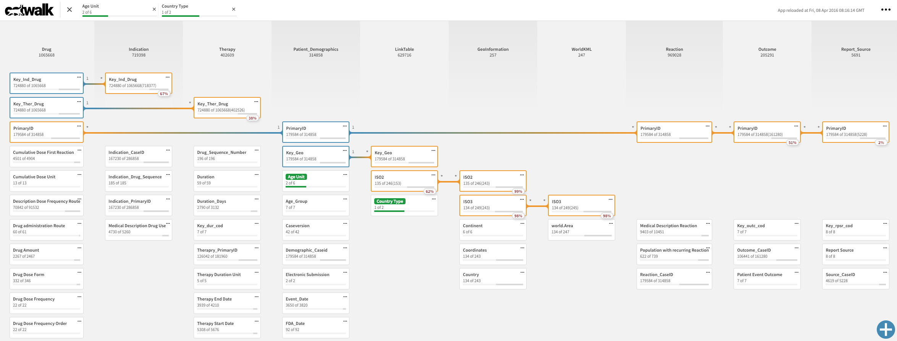

[](https://circleci.com/gh/qlik-oss/catwalk/tree/master)

Gain data model insights quickly during its development and validation phases. This tool is useful when you want to explore your data model for whatever reason; maybe you are creating a complex load script, maybe you want to investigate associations.



# Usage

For catwalk to work there are two things needed:
1. The UI
2. A Qlik Associative Engine app

## 1. UI

## Hosted

You can use catwalk from [catwalk.qlik.dev](https://catwalk.qlik.dev), where the latest master build is deployed. It can be used against any Qlik Associative Engine, local or hosted.

## Local

If you want to run/develop the catwalk UI locally, you need [Node.js](https://nodejs.org/en/) installed. Then run these commands in Git Bash/command prompt/terminal and follow the instructions on your screen:

```bash
git clone https://github.com/qlik-oss/catwalk.git
cd catwalk
npm install
npm start
```

## 2. Qlik Associative Engine
You need to provide catwalk with a websocket URL to the app. The URL is set with the `engine_url` query parameter.

### Example App
For convenience, there is an example app and docker-compose.yml in the catwalk repository
```bash
ACCEPT_EULA=yes docker-compose up -d
```
The docker-compose.yml in the repository will expose the Qlik Associative Engine app at:

`ws://localhost:9076/data/drugcases.qvf`

and is viewable in catwalk with e.g. `https://catwalk.qlik.dev/?engine_url=ws://localhost:9076/data/drugcases.qvf`

### Qlik Sense Desktop
For connecting to a Qlik Sense Desktop the websocket URL will be:

`ws://localhost:4848/app/<app-name>`

### Qlik Cloud Services / Qlik Sense Enterprise on Kubernetes
In order to connect to an app residing in Qlik Cloud Services or Qlik Sense Enterprise on Kubernetes, the `qlik-web-integration-id` has to be provided. You can create web integrations to add origins that are whitelisted to access the tenant. When a request arrives, Qlik Sense Enterprise confirms that the request derives from a whitelisted domain and then approves the request, else not. This is administered by tenant admins from the management console on the Integrations page. More info about this can be found [here](https://help.qlik.com/en-US/cloud-services/Subsystems/Hub/Content/Sense_Hub/Admin/mc-adminster-web-integrations.htm). The id is provided to catwalk by adding it as url parameter to the websocket address, e.g. `wss://tenant.qlikcloud.com/app/<app-guid>?qlik-web-integration-id=<web-integration-id>`.

### Qlik Sense Enterprise on Windows
The catwalk UI doesn't provide a login to the Qlik Sense app, but as long as there has been a login to the app in another tab/window the `X-Qlik-Session` cookie is set, and catwalk can "reuse" that session. The URL [catwalk.qlik.dev](https://catwalk.qlik.dev) has to be white listed in the QMC -> virtual proxy (per virtual proxy being used) for the Sense Proxy to allow sessions from catwalk. Since catwalk is running client side only, there is nothing other then the browser session and the engine that accesses the data in the app. This means that catwalk can be seen as any externally hosted mashup which also needs to be whitelisted.


### Tip 1:tada:
We created a Qlik Sense extension that can be found in the sense-extension folder that will create a link to the Qlik hosted catwalk UI with the current open app if "dragged" onto a sheet of you Qlik Sense app.
To install the extension you have to zip the folder and import it into you Qlik Sense installation, read more about how to do this [here](https://help.qlik.com/en-US/sense-developer/November2018/Subsystems/Extensions/Content/Sense_Extensions/Howtos/deploy-extensions.htm).

### Tip 2:tada:
We created a javascript bookmark that can be found in the [bookmark](./bookmark) folder that will open up a new tab to the Qlik hosted catwalk UI with the current open app.
To setup, create a bookmark and paste the content of [bookmark.js](./bookmark/bookmark.js) in the URL field.

# Data Policy
catwalk is running in a browser environment only, and creates a websocket connection directly to the QIX engine specified with the `engine_url` query parameter. This means that nothing other than the browser session and the engine will ever access the data in an app.

```
|-----------------|
| Browser running |
| catwalk    |----|------------|
|--------|---|----|            |
         |   |                 |
   |-----|---|-|           |---|----|
   |    you    |           | engine |
   |-----------|           |--------|
```
The only data collected is via Google Analytics which stores cookies on the users\` PC. This is to gain insight into how catwalk is used, how much and by whom. Examples of this information could be how long the users are staying, where the users are coming from (e.g. social media links, but also where in the world), and errors and exceptions.
